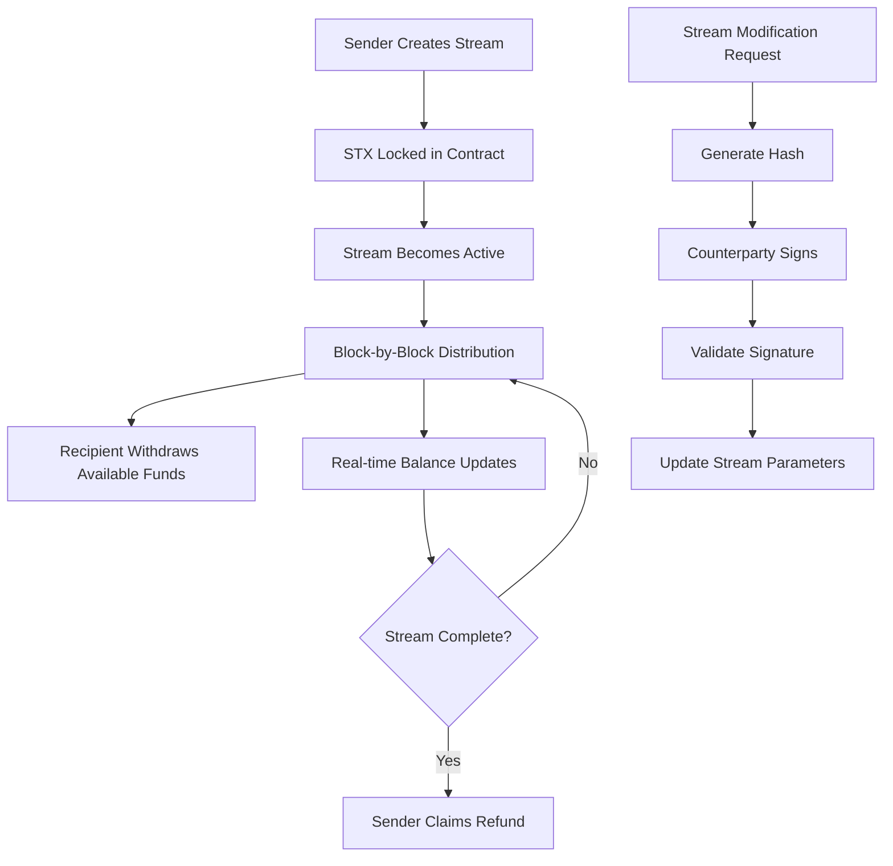

# ClarityStream - Decentralized Streaming Payments Protocol

[](https://stacks.org)
[](https://clarity-lang.org)
[](https://bitcoin.org)
[](LICENSE)

A revolutionary smart contract enabling continuous, block-by-block STX payments on the Bitcoin-secured Stacks blockchain. Perfect for salaries, subscriptions, vesting schedules, and any time-based payment streams.

## 🌟 Key Features

- **Trustless Streaming Payments** - Mathematical precision in continuous fund distribution
- **Bitcoin-Level Security** - Leverages Stacks consensus mechanism for maximum security
- **Dual-Signature Modifications** - Enhanced security through cryptographic consent mechanisms
- **Real-Time Balance Calculations** - Dynamic balance updates based on block progression
- **Efficient Fund Management** - Optimized refueling and withdrawal mechanisms
- **Zero-Trust Architecture** - No intermediaries or trusted third parties required

## 🏗️ System Overview

ClarityStream transforms traditional payment systems by enabling continuous fund flows that operate autonomously on the blockchain. Unlike conventional payments that occur at discrete intervals, ClarityStream creates seamless payment streams that distribute value block-by-block, providing unprecedented flexibility and transparency.

### Core Concepts

- **Stream**: A continuous payment channel from sender to recipient
- **Payment-per-Block**: Fixed STX amount distributed every Stacks block
- **Timeframe**: Defined start and stop blocks for stream duration
- **Balance Calculation**: Real-time computation of available funds based on block height

## 🏛️ Contract Architecture

### Data Structures

```clarity
streams: {
  uint => {
    sender: principal,
    recipient: principal,
    balance: uint,
    withdrawn-balance: uint,
    payment-per-block: uint,
    timeframe: {
      start-block: uint,
      stop-block: uint
    }
  }
}
```

### Core Functions

#### Stream Management

- `stream-to()` - Create new payment streams
- `refuel()` - Add funds to existing streams
- `withdraw()` - Recipient fund withdrawal
- `refund()` - Sender unused fund recovery

#### Security & Modifications

- `update-stream-details()` - Modify streams with dual consent
- `hash-stream()` - Generate cryptographic hashes
- `validate-signature()` - Verify secp256k1 signatures

#### Utilities

- `balance-of()` - Real-time balance queries
- `get-stream()` - Stream information retrieval
- `is-stream-active()` - Stream status verification

## 🔄 Data Flow



## 🚀 Quick Start

### Prerequisites

- [Clarinet](https://github.com/hirosystems/clarinet) installed
- Node.js 16+ for testing
- Stacks wallet for testnet deployment

### Installation

```bash
# Clone the repository
git clone https://github.com/abass-jamiu/clarity-stream.git
cd clarity-stream

# Install dependencies
npm install

# Run tests
npm test

# Check contract syntax
clarinet check
```

### Basic Usage

#### Creating a Stream

```clarity
;; Create a 1000 STX stream over 1000 blocks (1 STX per block)
(contract-call? .clarity-stream stream-to
  'SP2J6ZY48GV1EZ5V2V5RB9MP66SW86PYKKNRV9EJ7  ;; recipient
  u1000000000  ;; 1000 STX in microSTX
  { start-block: u100, stop-block: u1100 }  ;; timeframe
  u1000000     ;; 1 STX per block in microSTX
)
```

#### Withdrawing Funds

```clarity
;; Recipient withdraws available streamed funds
(contract-call? .clarity-stream withdraw u0)  ;; stream-id
```

#### Checking Balance

```clarity
;; Check available balance for any participant
(contract-call? .clarity-stream balance-of 
  u0  ;; stream-id
  'SP2J6ZY48GV1EZ5V2V5RB9MP66SW86PYKKNRV9EJ7  ;; address
)
```

## 📊 Use Cases

### 💼 Salary Streaming

Enable continuous salary payments to employees, providing real-time access to earned wages.

### 📱 Subscription Services

Create transparent, fair subscription models where users pay only for time consumed.

### 🏦 Vesting Schedules

Implement token vesting for startups and DAOs with mathematical precision.

### 🤝 Escrow Services

Facilitate trustless escrow with automatic fund release based on time progression.

### 💰 Investment Distributions

Automate profit sharing and dividend distributions to multiple stakeholders.

## 🔒 Security Features

### Cryptographic Protection

- **secp256k1 Signatures**: Bitcoin-standard elliptic curve cryptography
- **Deterministic Hashing**: SHA256-based message authentication
- **Dual Consent Mechanism**: Both parties must cryptographically agree to modifications

### Access Control

- **Principal-based Authorization**: Only stream participants can perform operations
- **Function-specific Permissions**: Granular access control for different operations
- **State Validation**: Comprehensive checks prevent invalid state transitions

### Error Handling

```clarity
ERR_UNAUTHORIZED (u100)          ;; Access denied
ERR_INVALID_SIGNATURE (u101)     ;; Cryptographic verification failed
ERR_STREAM_STILL_ACTIVE (u102)   ;; Operation requires completed stream
ERR_INVALID_STREAM_ID (u103)     ;; Stream does not exist
ERR_INSUFFICIENT_BALANCE (u104)  ;; Insufficient funds
ERR_INVALID_TIMEFRAME (u105)     ;; Invalid time parameters
```

## 🧪 Testing

Run the comprehensive test suite:

```bash
# Run all tests
npm test

# Run with coverage report
npm run test:report

# Watch mode for development
npm run test:watch
```

### Test Coverage

- Stream creation and validation
- Balance calculation accuracy
- Withdrawal and refund mechanisms
- Signature verification
- Edge case handling
- Error condition testing

## 📈 Performance Metrics

- **Gas Efficiency**: Optimized for minimal transaction costs
- **Scalability**: Supports unlimited concurrent streams
- **Precision**: Microsecond-level accuracy in calculations
- **Throughput**: Handles high-frequency operations efficiently

## 🛣️ Roadmap

- [ ] **Multi-token Support** - Extend beyond STX to SIP-010 tokens
- [ ] **Stream Templates** - Pre-configured stream types for common use cases
- [ ] **Governance Integration** - DAO-controlled stream parameters
- [ ] **Advanced Analytics** - On-chain metrics and reporting
- [ ] **Mobile SDK** - Native mobile application support
- [ ] **Cross-chain Bridges** - Integration with other blockchain networks

## 🤝 Contributing

We welcome contributions from the community! Please read our [Contributing Guidelines](CONTRIBUTING.md) for details on our code of conduct and the process for submitting pull requests.

### Development Setup

```bash
# Fork and clone the repository
git clone https://github.com/your-username/clarity-stream.git

# Create a feature branch
git checkout -b feature/amazing-feature

# Make your changes and test
npm test

# Commit with conventional commits
git commit -m "feat: add amazing feature"

# Push and create a pull request
git push origin feature/amazing-feature
```

## 📄 License

This project is licensed under the ISC License - see the [LICENSE](LICENSE) file for details.

## 🙏 Acknowledgments

- **Stacks Foundation** - For the innovative Bitcoin-anchored blockchain
- **Clarity Language Team** - For the secure smart contract language
- **Bitcoin Community** - For the foundational security layer
- **Open Source Contributors** - For continuous improvements and feedback
- 